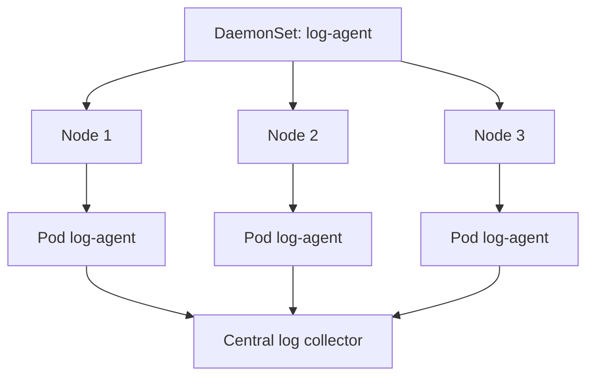

```mermaid
flowchart TB
    DS["DaemonSet: log-agent"] --> N1["Node 1"]
    DS --> N2["Node 2"]
    DS --> N3["Node 3"]
    N1 --> A1["Pod log-agent"]
    N2 --> A2["Pod log-agent"]
    N3 --> A3["Pod log-agent"]
    A1 --> C["Central log collector"]
    A2 --> C
    A3 --> C
```
