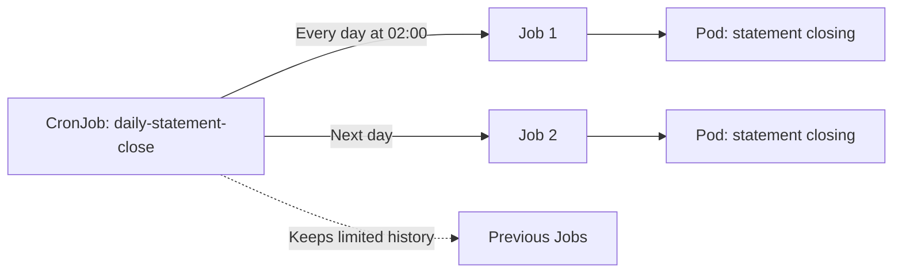

```mermaid
flowchart LR
    C["CronJob: daily-statement-close"] -->|"Every day at 02:00"| J1["Job 1"]
    C -->|"Next day"| J2["Job 2"]
    J1 --> P1["Pod: statement closing"]
    J2 --> P2["Pod: statement closing"]
    C -.->|"Keeps limited history"| H["Previous Jobs"]
```
