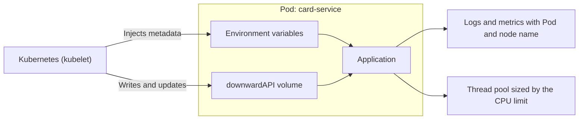

```mermaid
flowchart LR
    K["Kubernetes (kubelet)"] -->|"Injects metadata"| E["Environment variables"]
    K -->|"Writes and updates"| V["downwardAPI volume"]
    subgraph POD["Pod: card-service"]
        E --> A["Application"]
        V --> A
    end
    A --> L["Logs and metrics with Pod and node name"]
    A --> T["Thread pool sized by the CPU limit"]
```
