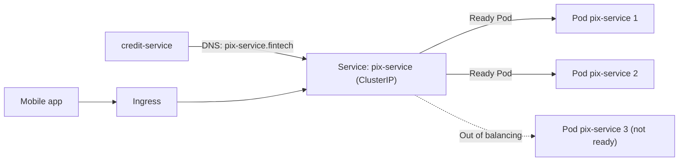

```mermaid
flowchart LR
    C["credit-service"] -->|"DNS: pix-service.fintech"| S["Service: pix-service (ClusterIP)"]
    S -->|"Ready Pod"| P1["Pod pix-service 1"]
    S -->|"Ready Pod"| P2["Pod pix-service 2"]
    S -.->|"Out of balancing"| P3["Pod pix-service 3 (not ready)"]
    I["Ingress"] --> S
    U["Mobile app"] --> I
```
