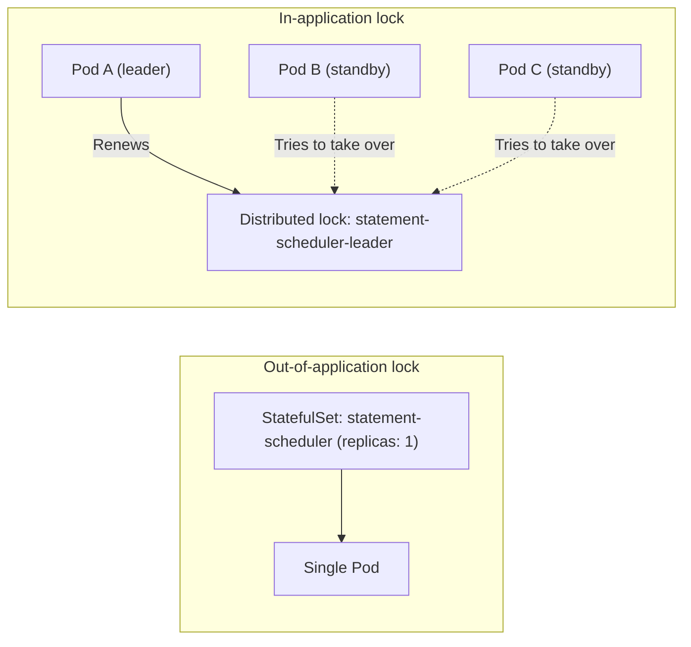

```mermaid
flowchart LR
    subgraph EXT["Out-of-application lock"]
        SS["StatefulSet: statement-scheduler (replicas: 1)"] --> P["Single Pod"]
    end
    subgraph INT["In-application lock"]
        L["Distributed lock: statement-scheduler-leader"]
        A["Pod A (leader)"]
        B["Pod B (standby)"]
        C["Pod C (standby)"]
        A -->|"Renews"| L
        B -.->|"Tries to take over"| L
        C -.->|"Tries to take over"| L
    end
```
