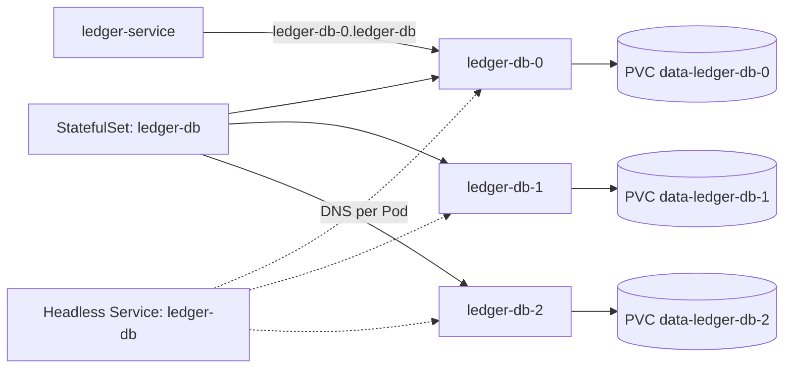

```mermaid
flowchart LR
    SS["StatefulSet: ledger-db"] --> P0["ledger-db-0"]
    SS --> P1["ledger-db-1"]
    SS --> P2["ledger-db-2"]
    P0 --> V0[("PVC data-ledger-db-0")]
    P1 --> V1[("PVC data-ledger-db-1")]
    P2 --> V2[("PVC data-ledger-db-2")]
    H["Headless Service: ledger-db"] -.->|"DNS per Pod"| P0
    H -.-> P1
    H -.-> P2
    L["ledger-service"] -->|"ledger-db-0.ledger-db"| P0
```
