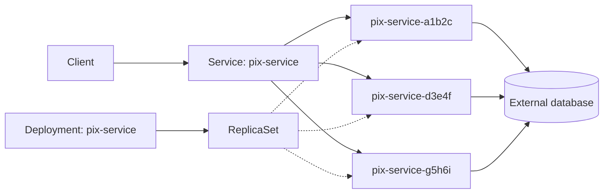

```mermaid
flowchart LR
    C["Client"] --> S["Service: pix-service"]
    S --> P1["pix-service-a1b2c"]
    S --> P2["pix-service-d3e4f"]
    S --> P3["pix-service-g5h6i"]
    D["Deployment: pix-service"] --> R["ReplicaSet"]
    R -.-> P1
    R -.-> P2
    R -.-> P3
    P1 --> DB[("External database")]
    P2 --> DB
    P3 --> DB
```
