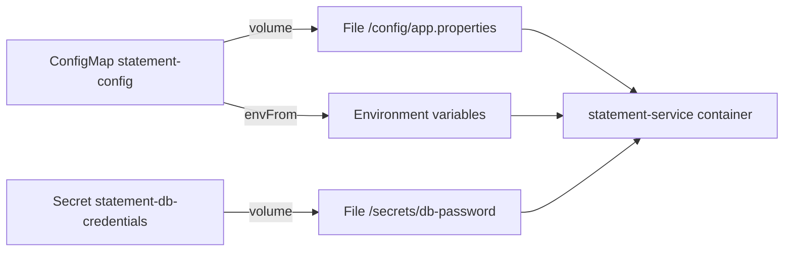

```mermaid
flowchart LR
    CM["ConfigMap statement-config"] -->|"volume"| FILE["File /config/app.properties"]
    CM -->|"envFrom"| ENV["Environment variables"]
    SEC["Secret statement-db-credentials"] -->|"volume"| CRED["File /secrets/db-password"]
    FILE --> APP["statement-service container"]
    ENV --> APP
    CRED --> APP
```
