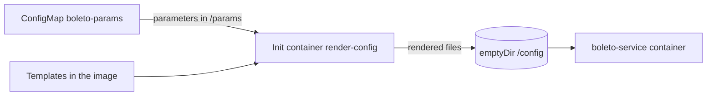

```mermaid
flowchart LR
    CM["ConfigMap boleto-params"] -->|"parameters in /params"| INIT["Init container render-config"]
    TPL["Templates in the image"] --> INIT
    INIT -->|"rendered files"| VOL[("emptyDir /config")]
    VOL --> APP["boleto-service container"]
```
