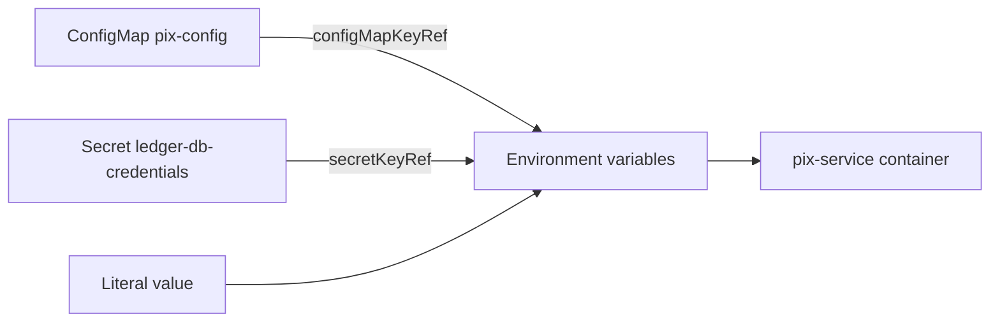

```mermaid
flowchart LR
    CM["ConfigMap pix-config"] -->|"configMapKeyRef"| ENV["Environment variables"]
    SEC["Secret ledger-db-credentials"] -->|"secretKeyRef"| ENV
    LIT["Literal value"] --> ENV
    ENV --> APP["pix-service container"]
```
