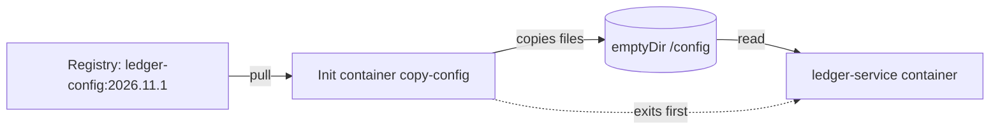

```mermaid
flowchart LR
    REG["Registry: ledger-config:2026.11.1"] -->|"pull"| INIT["Init container copy-config"]
    INIT -->|"copies files"| VOL[("emptyDir /config")]
    VOL -->|"read"| APP["ledger-service container"]
    INIT -.->|"exits first"| APP
```
