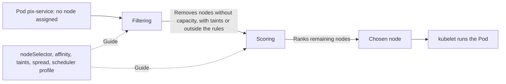

```mermaid
flowchart LR
    P["Pod pix-service: no node assigned"] --> F["Filtering"]
    F -->|"Removes nodes without capacity, with taints or outside the rules"| SC["Scoring"]
    SC -->|"Ranks remaining nodes"| B["Chosen node"]
    B --> K["kubelet runs the Pod"]
    AF["nodeSelector, affinity, taints, spread, scheduler profile"] -.->|"Guide"| F
    AF -.->|"Guide"| SC
```
