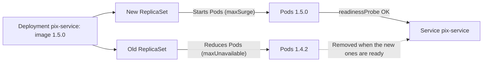

```mermaid
flowchart LR
    D["Deployment pix-service: image 1.5.0"] --> RS2["New ReplicaSet"]
    D --> RS1["Old ReplicaSet"]
    RS2 -->|"Starts Pods (maxSurge)"| P2["Pods 1.5.0"]
    P2 -->|"readinessProbe OK"| SVC["Service pix-service"]
    RS1 -->|"Reduces Pods (maxUnavailable)"| P1["Pods 1.4.2"]
    P1 -.->|"Removed when the new ones are ready"| SVC
```
