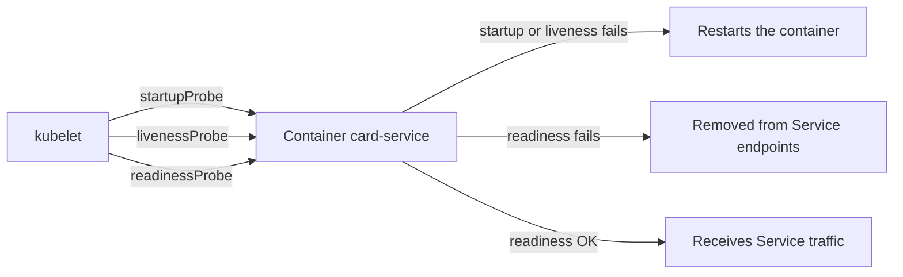

```mermaid
flowchart LR
    K["kubelet"] -->|"startupProbe"| A["Container card-service"]
    K -->|"livenessProbe"| A
    K -->|"readinessProbe"| A
    A -->|"startup or liveness fails"| R["Restarts the container"]
    A -->|"readiness fails"| E["Removed from Service endpoints"]
    A -->|"readiness OK"| S["Receives Service traffic"]
```
