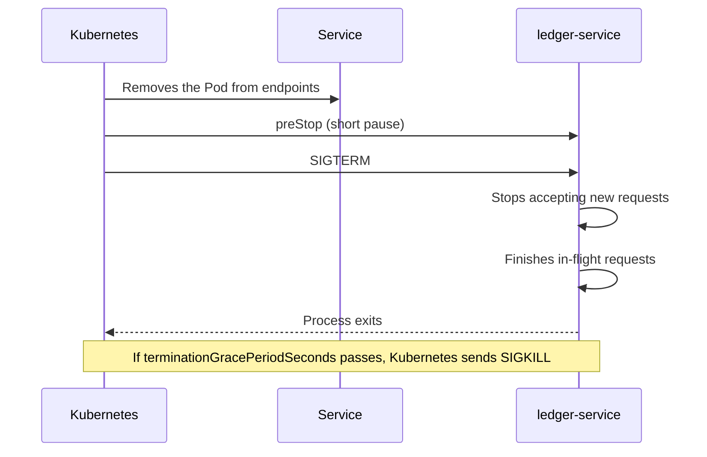

```mermaid
sequenceDiagram
    participant K as Kubernetes
    participant S as Service
    participant C as ledger-service
    K->>S: Removes the Pod from endpoints
    K->>C: preStop (short pause)
    K->>C: SIGTERM
    C->>C: Stops accepting new requests
    C->>C: Finishes in-flight requests
    C-->>K: Process exits
    Note over K,C: If terminationGracePeriodSeconds passes, Kubernetes sends SIGKILL
```
