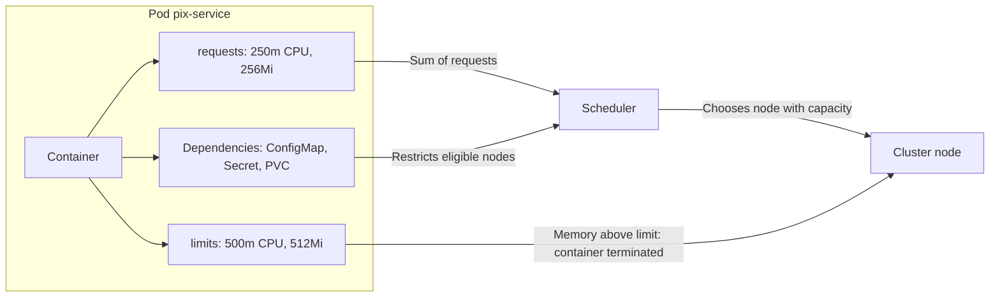

```mermaid
flowchart LR
    subgraph Pod["Pod pix-service"]
        C["Container"] --> R["requests: 250m CPU, 256Mi"]
        C --> L["limits: 500m CPU, 512Mi"]
        C --> D["Dependencies: ConfigMap, Secret, PVC"]
    end
    R -->|"Sum of requests"| S["Scheduler"]
    D -->|"Restricts eligible nodes"| S
    S -->|"Chooses node with capacity"| N["Cluster node"]
    L -->|"Memory above limit: container terminated"| N
```
