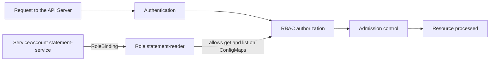

```mermaid
flowchart LR
    REQ["Request to the API Server"] --> AUTHN["Authentication"]
    AUTHN --> AUTHZ["RBAC authorization"]
    AUTHZ --> ADM["Admission control"]
    ADM --> OK["Resource processed"]
    SA["ServiceAccount statement-service"] -->|"RoleBinding"| ROLE["Role statement-reader"]
    ROLE -->|"allows get and list on ConfigMaps"| AUTHZ
```
