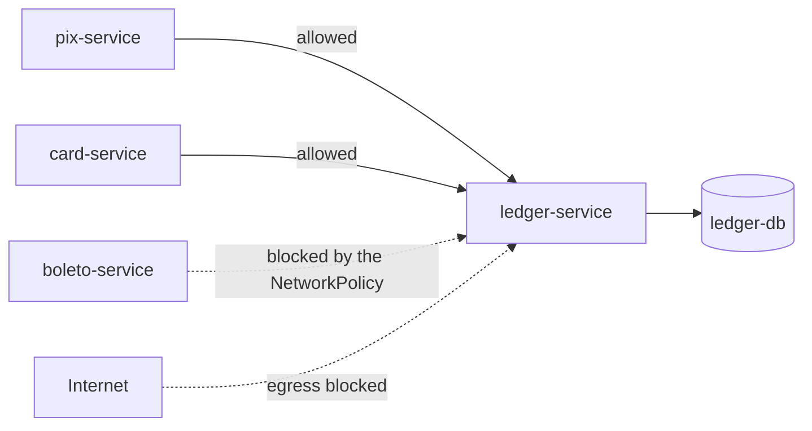

```mermaid
flowchart LR
    PIX["pix-service"] -->|"allowed"| LEDGER["ledger-service"]
    CARD["card-service"] -->|"allowed"| LEDGER
    BOLETO["boleto-service"] -.->|"blocked by the NetworkPolicy"| LEDGER
    LEDGER --> DB[("ledger-db")]
    EXT["Internet"] -.->|"egress blocked"| LEDGER
```
