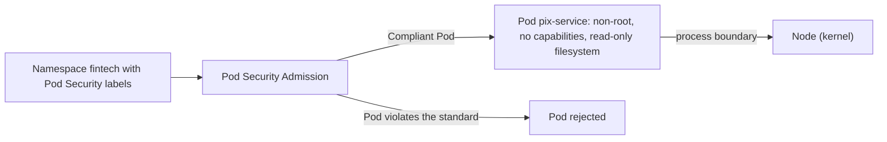

```mermaid
flowchart LR
    NS["Namespace fintech with Pod Security labels"] --> PSA["Pod Security Admission"]
    PSA -->|"Compliant Pod"| POD["Pod pix-service: non-root, no capabilities, read-only filesystem"]
    PSA -->|"Pod violates the standard"| REJ["Pod rejected"]
    POD -->|"process boundary"| NODE["Node (kernel)"]
```
