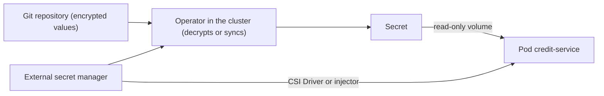

```mermaid
flowchart LR
    GIT["Git repository (encrypted values)"] --> OP["Operator in the cluster (decrypts or syncs)"]
    SMS["External secret manager"] --> OP
    OP --> SEC["Secret"]
    SEC -->|"read-only volume"| POD["Pod credit-service"]
    SMS -->|"CSI Driver or injector"| POD
```
