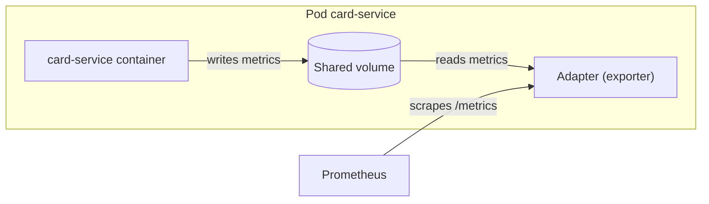

```mermaid
flowchart LR
    subgraph Pod["Pod card-service"]
        direction LR
        A["card-service container"] -->|"writes metrics"| V[("Shared volume")]
        V -->|"reads metrics"| AD["Adapter (exporter)"]
    end
    P["Prometheus"] -->|"scrapes /metrics"| AD
```
