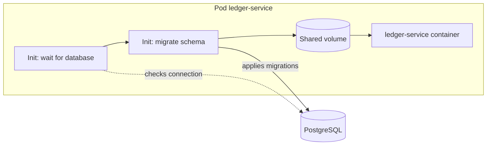

```mermaid
flowchart LR
    subgraph Pod["Pod ledger-service"]
        direction LR
        I1["Init: wait for database"] --> I2["Init: migrate schema"]
        I2 --> V[("Shared volume")]
        V --> A["ledger-service container"]
    end
    DB[("PostgreSQL")]
    I1 -.->|"checks connection"| DB
    I2 -->|"applies migrations"| DB
```
