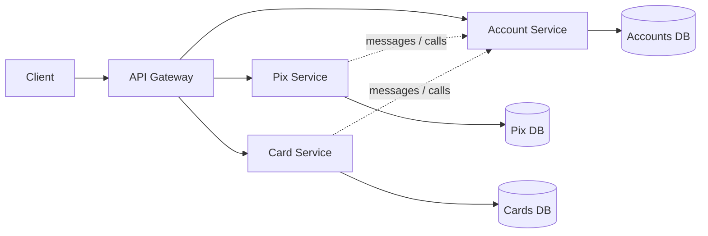

```mermaid
flowchart LR
    C[Client] --> GW[API Gateway]
    GW --> S1[Account Service]
    GW --> S2[Pix Service]
    GW --> S3[Card Service]
    S1 --> DB1[(Accounts DB)]
    S2 --> DB2[(Pix DB)]
    S3 --> DB3[(Cards DB)]
    S2 -. "messages / calls" .-> S1
    S3 -. "messages / calls" .-> S1
```
