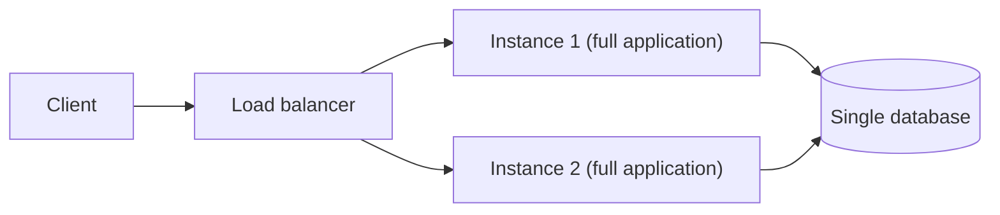

```mermaid
flowchart LR
    C[Client] --> LB[Load balancer]
    LB --> I1["Instance 1 (full application)"]
    LB --> I2["Instance 2 (full application)"]
    I1 --> DB[(Single database)]
    I2 --> DB
```
