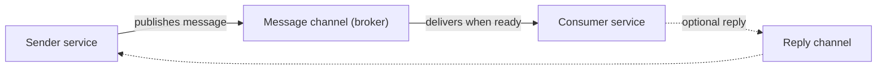

```mermaid
flowchart LR
    A["Sender service"] -->|"publishes message"| C["Message channel (broker)"]
    C -->|"delivers when ready"| B["Consumer service"]
    B -.->|"optional reply"| R["Reply channel"]
    R -.-> A
```
