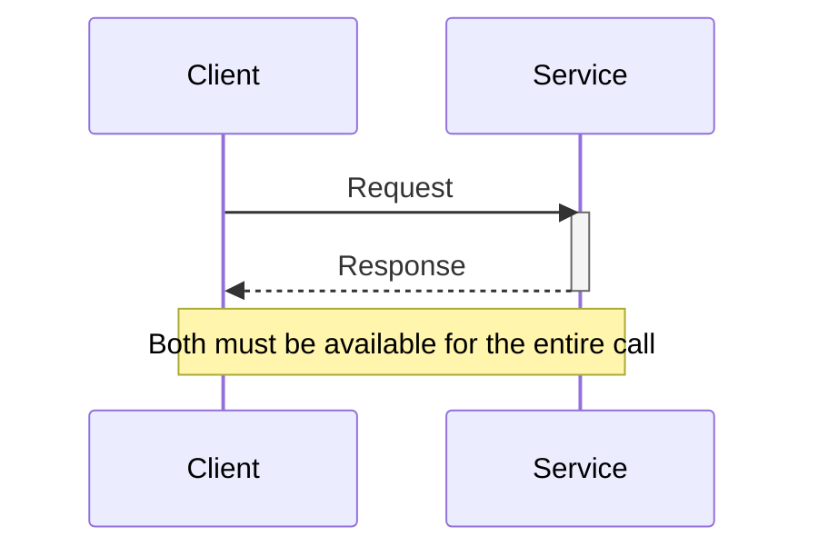

```mermaid
sequenceDiagram
    participant C as Client
    participant S as Service
    C->>S: Request
    activate S
    S-->>C: Response
    deactivate S
    Note over C,S: Both must be available for the entire call
```
