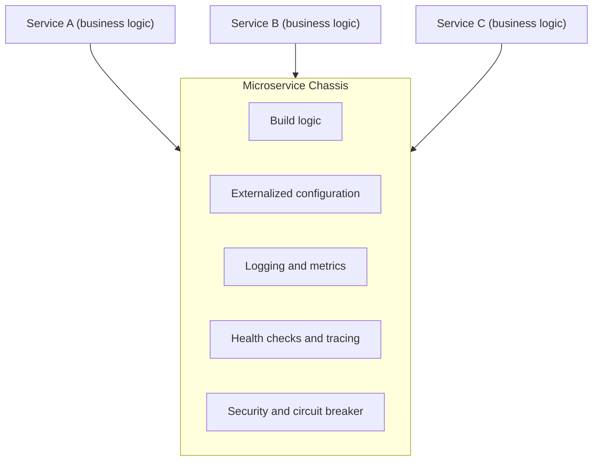

```mermaid
flowchart TB
    subgraph Chassis["Microservice Chassis"]
        B["Build logic"]
        C1["Externalized configuration"]
        C2["Logging and metrics"]
        C3["Health checks and tracing"]
        C4["Security and circuit breaker"]
    end
    S1["Service A (business logic)"] --> Chassis
    S2["Service B (business logic)"] --> Chassis
    S3["Service C (business logic)"] --> Chassis
```
