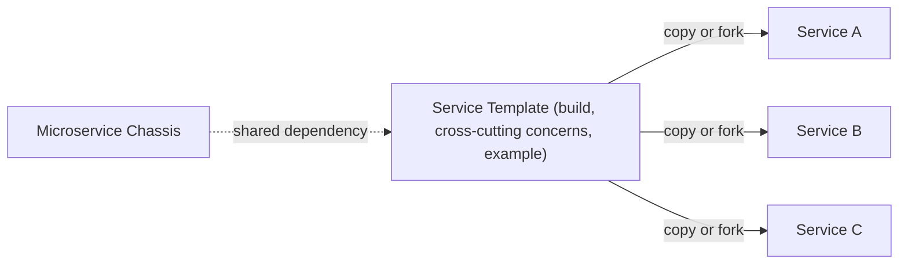

```mermaid
flowchart LR
    T["Service Template (build, cross-cutting concerns, example)"] -- "copy or fork" --> A["Service A"]
    T -- "copy or fork" --> B["Service B"]
    T -- "copy or fork" --> C["Service C"]
    CH["Microservice Chassis"] -. "shared dependency" .-> T
```
