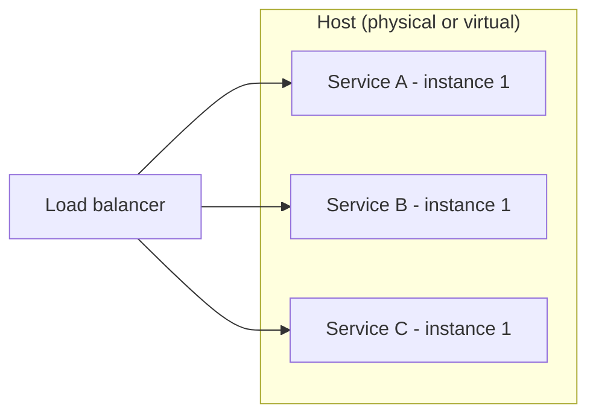

```mermaid
flowchart LR
    subgraph Host["Host (physical or virtual)"]
        A["Service A - instance 1"]
        B["Service B - instance 1"]
        C["Service C - instance 1"]
    end
    LB["Load balancer"] --> A
    LB --> B
    LB --> C
```
