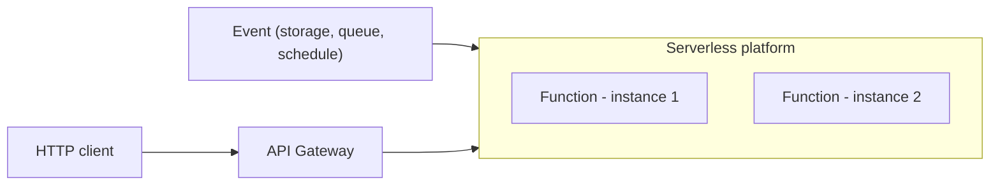

```mermaid
flowchart LR
    Cli["HTTP client"] --> GW["API Gateway"]
    Evt["Event (storage, queue, schedule)"] --> Plat
    GW --> Plat
    subgraph Plat["Serverless platform"]
        F1["Function - instance 1"]
        F2["Function - instance 2"]
    end
```
