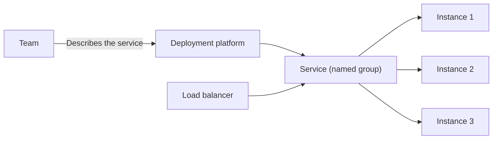

```mermaid
flowchart LR
    Dev["Team"] -->|"Describes the service"| P["Deployment platform"]
    P --> S["Service (named group)"]
    S --> I1["Instance 1"]
    S --> I2["Instance 2"]
    S --> I3["Instance 3"]
    LB["Load balancer"] --> S
```
