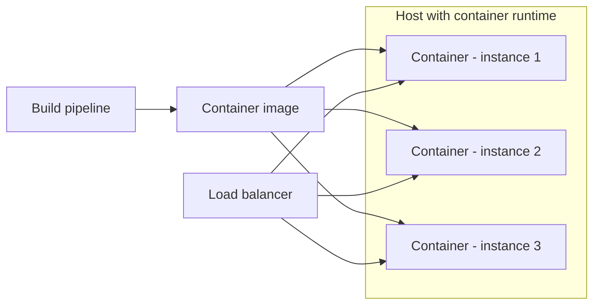

```mermaid
flowchart LR
    Build["Build pipeline"] --> Img["Container image"]
    Img --> C1["Container - instance 1"]
    Img --> C2["Container - instance 2"]
    Img --> C3["Container - instance 3"]
    subgraph Host["Host with container runtime"]
        C1
        C2
        C3
    end
    LB["Load balancer"] --> C1
    LB --> C2
    LB --> C3
```
