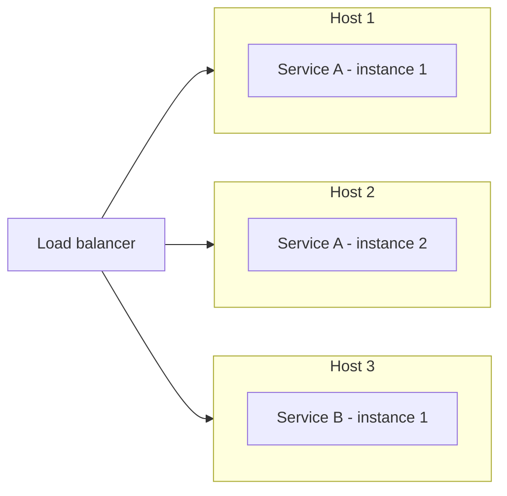

```mermaid
flowchart LR
    LB["Load balancer"] --> H1
    LB --> H2
    LB --> H3
    subgraph H1["Host 1"]
        A1["Service A - instance 1"]
    end
    subgraph H2["Host 2"]
        A2["Service A - instance 2"]
    end
    subgraph H3["Host 3"]
        B1["Service B - instance 1"]
    end
```
