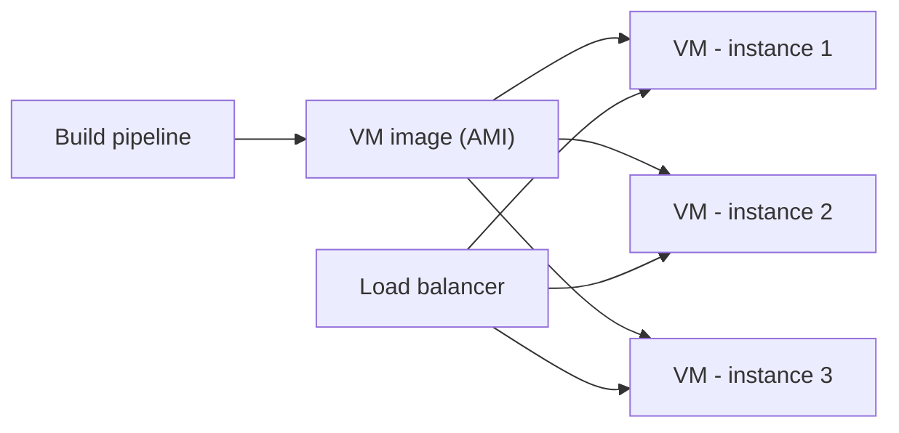

```mermaid
flowchart LR
    Build["Build pipeline"] --> Img["VM image (AMI)"]
    Img --> VM1["VM - instance 1"]
    Img --> VM2["VM - instance 2"]
    Img --> VM3["VM - instance 3"]
    LB["Load balancer"] --> VM1
    LB --> VM2
    LB --> VM3
```
