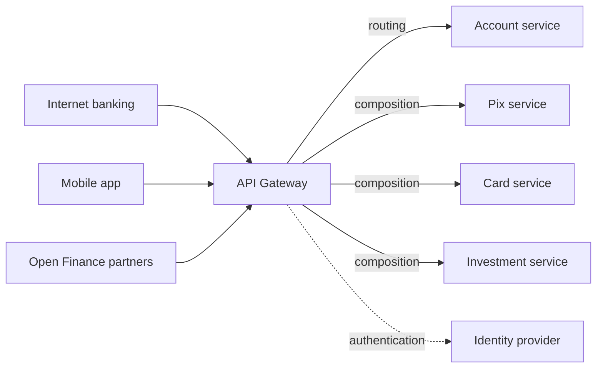

```mermaid
flowchart LR
    W["Internet banking"] --> G["API Gateway"]
    M["Mobile app"] --> G
    T["Open Finance partners"] --> G
    G -->|"routing"| S1["Account service"]
    G -->|"composition"| S2["Pix service"]
    G -->|"composition"| S3["Card service"]
    G -->|"composition"| S4["Investment service"]
    G -.->|"authentication"| A["Identity provider"]
```
