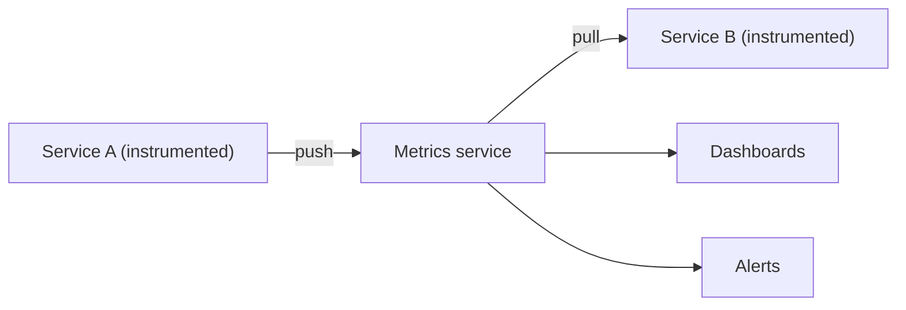

```mermaid
flowchart LR
    S1["Service A (instrumented)"]
    S2["Service B (instrumented)"]
    M["Metrics service"]
    D["Dashboards"]
    AL["Alerts"]

    S1 -->|"push"| M
    M -->|"pull"| S2
    M --> D
    M --> AL
```
