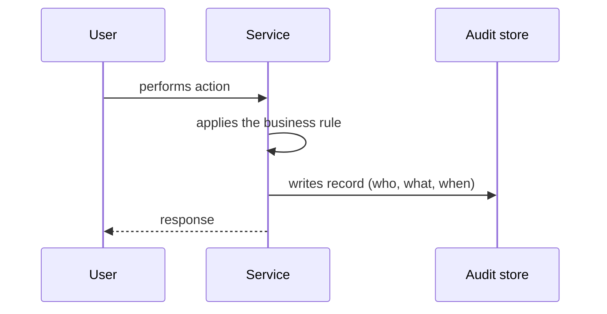

```mermaid
sequenceDiagram
    participant U as User
    participant S as Service
    participant A as Audit store
    U->>S: performs action
    S->>S: applies the business rule
    S->>A: writes record (who, what, when)
    S-->>U: response
```
