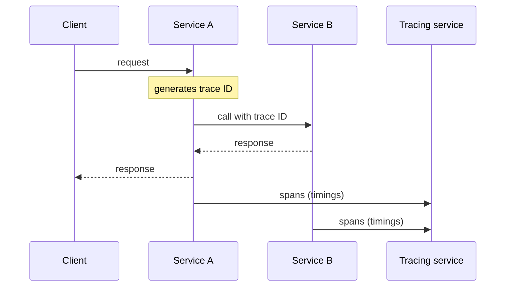

```mermaid
sequenceDiagram
    participant C as Client
    participant A as Service A
    participant B as Service B
    participant T as Tracing service
    C->>A: request
    Note over A: generates trace ID
    A->>B: call with trace ID
    B-->>A: response
    A-->>C: response
    A->>T: spans (timings)
    B->>T: spans (timings)
```
