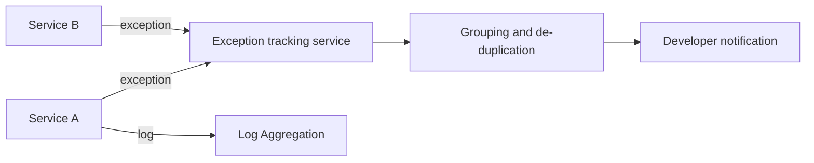

```mermaid
flowchart LR
    S1["Service A"] -->|"exception"| E["Exception tracking service"]
    S2["Service B"] -->|"exception"| E
    S1 -->|"log"| L["Log Aggregation"]
    E --> G["Grouping and de-duplication"]
    G --> N["Developer notification"]
```
