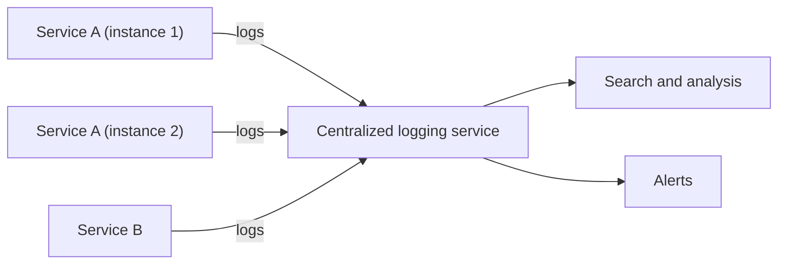

```mermaid
flowchart LR
    A1["Service A (instance 1)"] -->|"logs"| C["Centralized logging service"]
    A2["Service A (instance 2)"] -->|"logs"| C
    B["Service B"] -->|"logs"| C
    C --> S["Search and analysis"]
    C --> AL["Alerts"]
```
