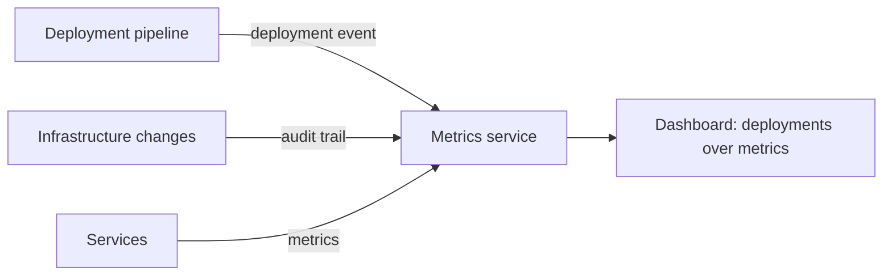

```mermaid
flowchart LR
    P["Deployment pipeline"] -->|"deployment event"| M["Metrics service"]
    I["Infrastructure changes"] -->|"audit trail"| M
    S["Services"] -->|"metrics"| M
    M --> D["Dashboard: deployments over metrics"]
```
