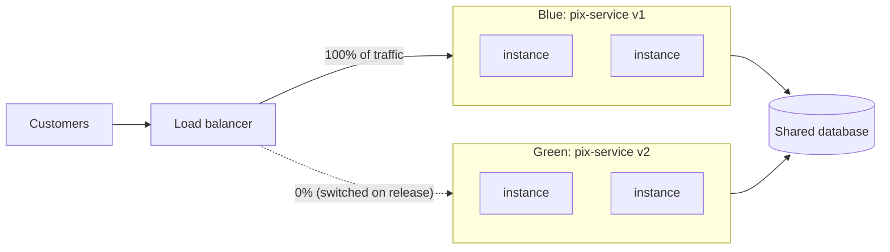

```mermaid
flowchart LR
    Cli["Customers"] --> LB["Load balancer"]
    LB -- "100% of traffic" --> Blue
    LB -. "0% (switched on release)" .-> Green
    subgraph Blue["Blue: pix-service v1"]
        B1["instance"]
        B2["instance"]
    end
    subgraph Green["Green: pix-service v2"]
        G1["instance"]
        G2["instance"]
    end
    Blue --> DB[("Shared database")]
    Green --> DB
```
