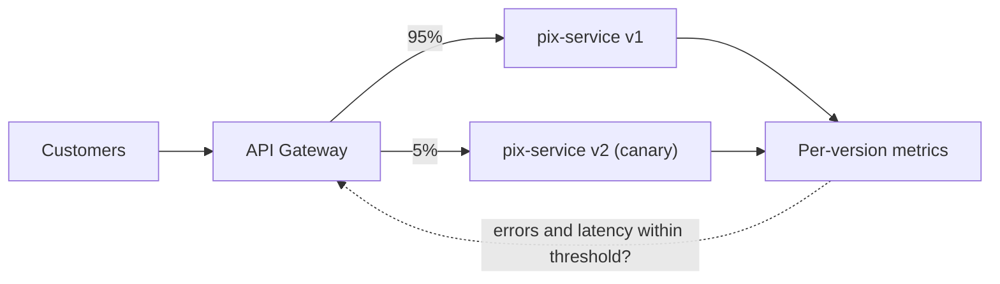

```mermaid
flowchart LR
    Cli["Customers"] --> GW["API Gateway"]
    GW -- "95%" --> V1["pix-service v1"]
    GW -- "5%" --> V2["pix-service v2 (canary)"]
    V1 --> Met["Per-version metrics"]
    V2 --> Met
    Met -. "errors and latency within threshold?" .-> GW
```
