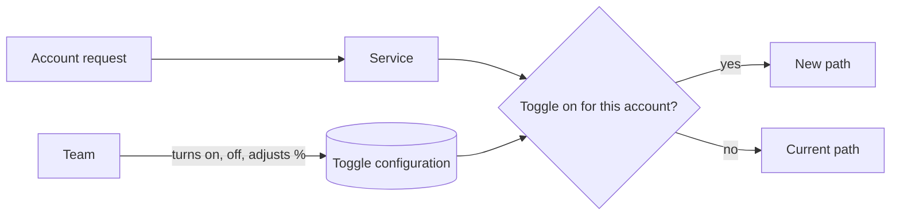

```mermaid
flowchart LR
    Ops["Team"] -- "turns on, off, adjusts %" --> Cfg[("Toggle configuration")]
    Req["Account request"] --> Svc["Service"]
    Svc --> Eval{"Toggle on for this account?"}
    Cfg --> Eval
    Eval -- "yes" --> New["New path"]
    Eval -- "no" --> Old["Current path"]
```
