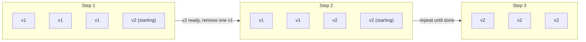

```mermaid
flowchart LR
    subgraph Passo1["Step 1"]
        A1["v1"]
        A2["v1"]
        A3["v1"]
        A4["v2 (starting)"]
    end
    subgraph Passo2["Step 2"]
        B1["v1"]
        B2["v1"]
        B3["v2"]
        B4["v2 (starting)"]
    end
    subgraph Passo3["Step 3"]
        C1["v2"]
        C2["v2"]
        C3["v2"]
    end
    Passo1 -- "v2 ready, remove one v1" --> Passo2
    Passo2 -- "repeat until done" --> Passo3
```
