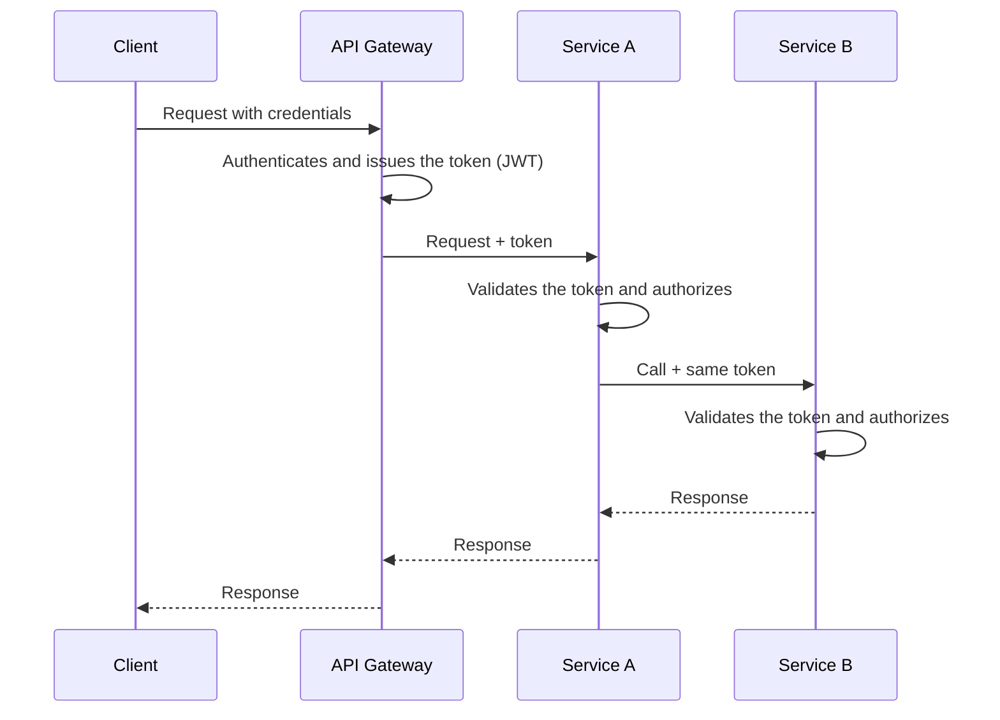

```mermaid
sequenceDiagram
    participant C as Client
    participant G as API Gateway
    participant A as Service A
    participant B as Service B
    C->>G: Request with credentials
    G->>G: Authenticates and issues the token (JWT)
    G->>A: Request + token
    A->>A: Validates the token and authorizes
    A->>B: Call + same token
    B->>B: Validates the token and authorizes
    B-->>A: Response
    A-->>G: Response
    G-->>C: Response
```
