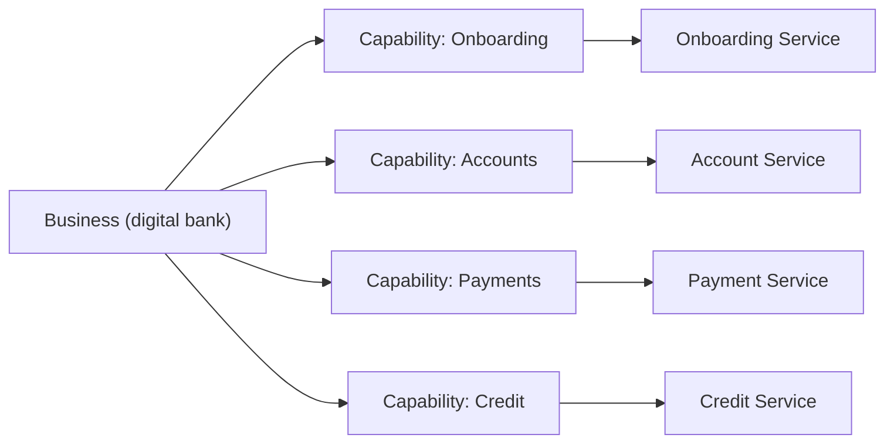

```mermaid
flowchart LR
    N["Business (digital bank)"] --> C1["Capability: Onboarding"]
    N --> C2["Capability: Accounts"]
    N --> C3["Capability: Payments"]
    N --> C4["Capability: Credit"]
    C1 --> S1["Onboarding Service"]
    C2 --> S2["Account Service"]
    C3 --> S3["Payment Service"]
    C4 --> S4["Credit Service"]
```
