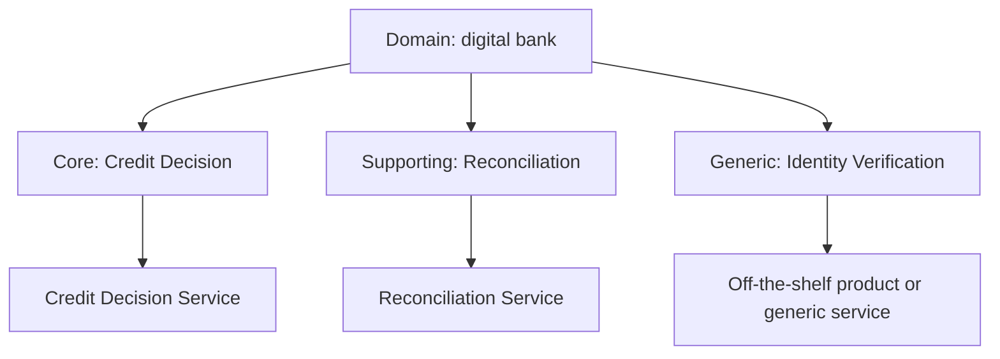

```mermaid
flowchart TB
    D["Domain: digital bank"] --> CORE["Core: Credit Decision"]
    D --> SUP["Supporting: Reconciliation"]
    D --> GEN["Generic: Identity Verification"]
    CORE --> S1["Credit Decision Service"]
    SUP --> S2["Reconciliation Service"]
    GEN --> S3["Off-the-shelf product or generic service"]
```
