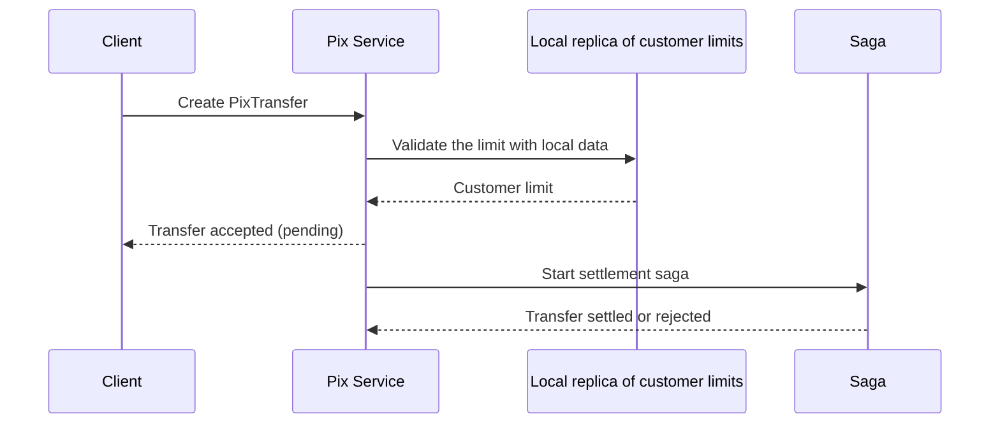

```mermaid
sequenceDiagram
    participant C as Client
    participant P as Pix Service
    participant R as Local replica of customer limits
    participant S as Saga
    C->>P: Create PixTransfer
    P->>R: Validate the limit with local data
    R-->>P: Customer limit
    P-->>C: Transfer accepted (pending)
    P->>S: Start settlement saga
    S-->>P: Transfer settled or rejected
```
