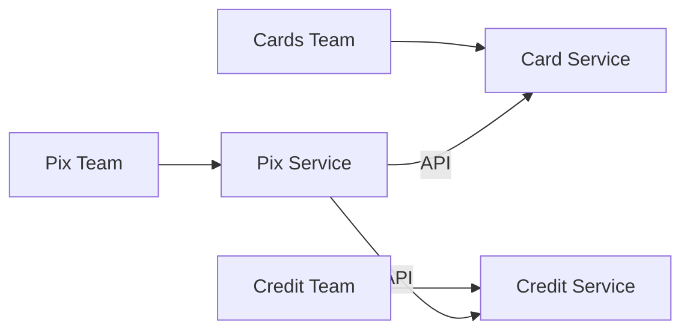

```mermaid
flowchart LR
    T1["Pix Team"] --> S1["Pix Service"]
    T2["Cards Team"] --> S2["Card Service"]
    T3["Credit Team"] --> S3["Credit Service"]
    S1 -->|"API"| S2
    S1 -->|"API"| S3
```
